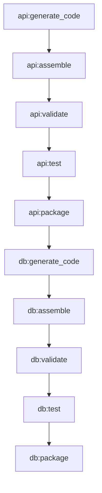

# Phase 2 — TaskGraph & Décomposition

**Règle d’or** : *Vérité stricte, traçabilité totale, documentation à chaque étape.*

## Livrables (cette PR)
- `core/task_graph.py` — Modèle de données Pydantic (Task, Artifact, TaskGraph), hash stable, export JSON, Mermaid.
- `agents/task_decomposer/` — Agent déterministe de décomposition plan → DAG.
- `schemas/task_graph.schema.json` — Schéma JSON d’export.
- `examples/plan.sample.yaml` — Exemple de plan minimal.
- `tests/test_task_graph.py`, `tests/test_task_decomposer.py` — Couverture de base (cycles, hash, idempotence).

## Modèle TaskGraph (résumé)
- **Task.id** : SHA-256 du JSON canonique (`ns=plan_id` + contenu tâche), tronqué à 16 hex — déterministe.
- **Acyclicité** : Kahn (BFS). Échec → `ValueError`.
- **Ordonnancement** : `topological_order()` renvoie les ids en ordre.
- **Hash global** : SHA-256 du JSON canonique `{plan_id, tasks triés par (id,name)}`.
- **Export** : `to_json()` + `to_mermaid()` (Mermaid).

## Décomposition (heuristiques)
1. **Plan explicite** : si `plan.tasks[]` existe, respecter `id`, `depends_on`, `type` (validation sans cycles).
2. **Plan par composants** : sinon, détecter `components|modules|services|packages` (dict/list).  
   - Stages par défaut : `["generate_code","assemble","validate","test","package","deploy"]`  
   - `stages.<name>: false` pour désactiver une étape globalement.
   - `component_order: ["api","worker"]` (optionnel) pour lier *dernier(api) → premier(worker)*
   - IDs gelés (déterministes) pour reproductibilité.

## Exemple visuel (Mermaid)

## Intégration
- **Arborescence** (alignée `pyproject.toml`): `core/`, `agents/`, `tests/`, `schemas/`, `examples/`.
- Aucune modification des artefacts Phases 0–1.
- Ajouts **backwards-compatible**.

## Critères d’acceptation
- Même plan ⇒ **même** `TaskGraph.stable_hash()` et mêmes ids.
- `validate_acyclic()` ne lève pas d’erreur pour les plans valides.
- Export JSON valide selon `schemas/task_graph.schema.json` (validation en option).
- Tests : `pytest -q` verts localement.

## Limitations connues
- **QUESTION**: `schemas/plan.schema.json` non fourni dans l’archive reçue. Les heuristiques couvrent les cas communs, mais l’alignement fin doit être fait si un schéma officiel existe.
- **QUESTION**: Le code Phases 0–1 (FastAPI, logging, tests) n’était pas présent dans le zip fourni. L’intégration est pensée pour cohabiter sans conflit mais n’a pas pu être *exécutée* ici.

## Prochaines étapes (Phase 2 → 2.x)
- Valider le mapping exact avec `plan.schema.json` (si disponible) et ajouter parseurs stricts.
- Ajouter `task_graph.validate(schema=schemas/task_graph.schema.json)` si `jsonschema` est accepté en dépendance dev.
- Exposer un endpoint `GET /taskgraph/preview` qui produit Mermaid pour un plan donné (sans side effects).
